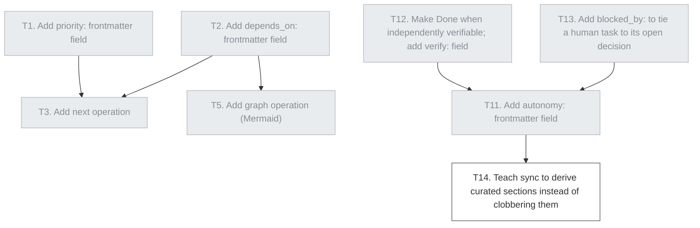

> Frontmatter is the source of truth. This index is a derived view — if they disagree, read the individual .md files.

## D1 — Agent self-dispatch

- [x] [T1. Add `priority:` frontmatter field](t1-add-priority-field.md) — `done` → SKILL.md
- [x] [T2. Add `depends_on:` frontmatter field](t2-add-depends-on-field.md) — `done` → SKILL.md
- [x] [T3. Add `next` operation](t3-add-next-operation.md) — `done` → SKILL.md
- [x] [T4. Add `claimed_by:` attribution to `start`](t4-add-claimed-by-attribution.md) — `done` → SKILL.md
- [x] [T5. Add `graph` operation (Mermaid)](t5-add-graph-operation.md) — `done` → SKILL.md
- [x] [T11. Add `autonomy:` frontmatter field](t11-add-autonomy-field.md) — `done` `p1` → SKILL.md
- [x] [T12. Make `Done when` independently verifiable; add `verify:` field](t12-verifiable-done-when.md) — `done` `p1` → SKILL.md
- [x] [T13. Add `blocked_by:` to tie a human task to its open decision](t13-add-blocked-by-field.md) — `done` → SKILL.md

## D2 — Lifecycle & tooling

- [x] [T6. Add `migrate` operation](t6-add-migrate-operation.md) — `done` → SKILL.md
- [x] [T7. Add optional validation script](t7-add-validation-script.md) — `done` → scripts/opentasks-lint
- [ ] [T14. Teach `sync` to derive curated sections instead of clobbering them](t14-sync-derive-sections.md) — `todo`

## D3 — Docs & examples

- [x] [T8. Add `examples/` folder with a populated sample](t8-add-examples-folder.md) — `done` → examples/docs/tasks/
- [x] [T9. Make SKILL.md canonical; slim the README](t9-canonicalize-skill-md.md) — `done` → README.md
- [x] [T10. Document how to update an installed skill](t10-document-skill-updates.md) — `done` → README.md
- [ ] [T15. Document recording provenance for review-spawned tasks](t15-document-review-provenance.md) — `todo` `p3`

## Open questions

**For luisa:**
- [ ] [Q1. Should task state live on a branch that is always pushed, and how?](q1-tasks-on-always-pushed-branch.md) — `todo`

## Dependency graph

